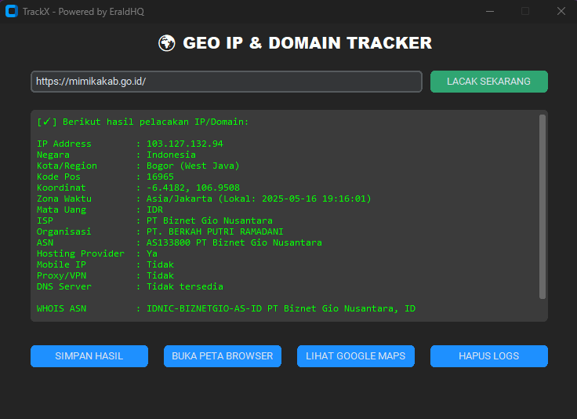

# 🌍 TrackX - GEO IP & Domain Tracker 🇮🇩

**TrackX** adalah aplikasi GUI OSINT berbasis Python yang dapat melakukan pelacakan lokasi IP & domain secara real-time, menampilkan hasil intelijen secara mendetail, serta memvisualisasikan lokasi dalam bentuk peta interaktif dan Google Maps. Dilengkapi fitur WHOIS ASN, Reverse DNS, Proxy Checker, DNS Server Resolver, dan pencatatan otomatis ke database lokal.

>  Dibuat oleh saya

---

## ✨ Fitur Unggulan

✅ Lacak IP address dan domain publik secara real-time  
✅ Tampilkan data detail seperti negara, kota, ISP, ASN, proxy/VPN, dan koordinat GPS  
✅ Reverse DNS Lookup & WHOIS ASN otomatis  
✅ Deteksi DNS server aktif dan waktu lokal berdasarkan zona target  
✅ Pemetaan lokasi otomatis dengan `folium` + ekspor ke browser  
✅ Integrasi langsung ke Google Maps  
✅ Simpan hasil pelacakan ke file teks (`hasil_lacak.txt`)  
✅ Database lokal (`SQLite`) untuk menyimpan log historis  
✅ Antarmuka modern berbasis `customtkinter`  
✅ Support domain berbasis CDN (Cloudflare, Akamai, dll.) dengan resolusi fallback DNS

---

## 🖥️ Screenshot UI

  
---

## 🚀 Instalasi Manual
- Downloads filenya dan setelah diunduh anda harus menginstal sesuai di install dependencies 
dan setelah itu jalankan file python TrackX.py dan anda sudh dapat menggunakannya 


## 🔗 Persyarat

- Python 3.10+
- Pip

### 🔧 Install Dependencies

```bash
pip install customtkinter requests dnspython ipwhois pytz folium

